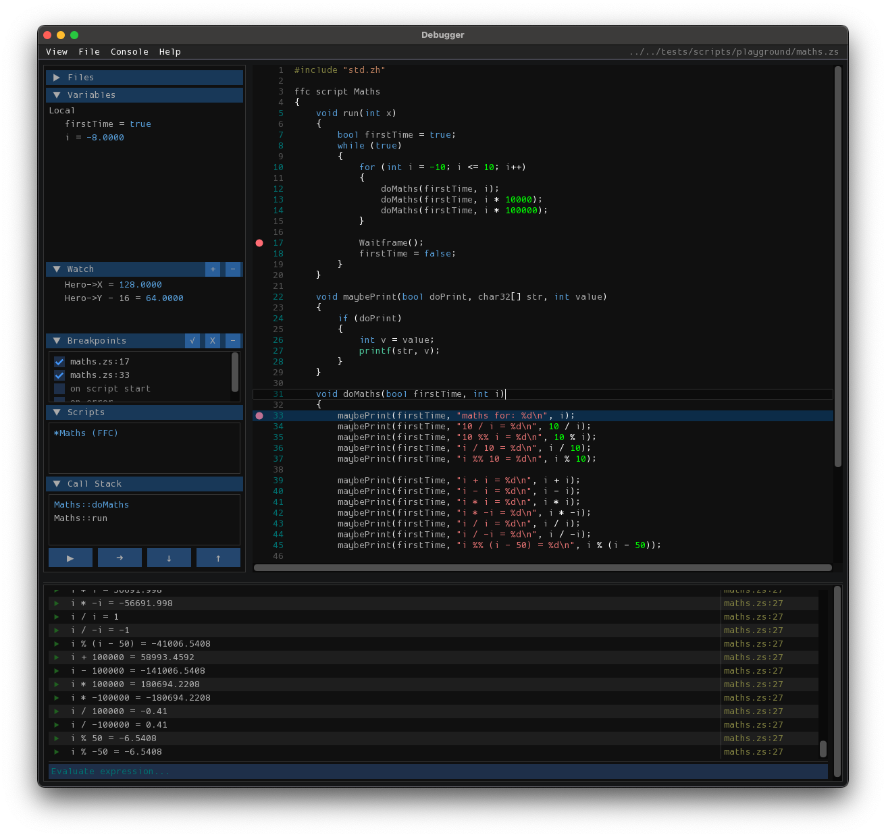

.. _debugger:

Debugger
========

.. versionadded:: 3.0

The ZScript debugger provides a fully integrated environment for inspecting and debugging scripts in real-time. It features a rich console, breakpoints, and advanced navigation tools.

This is currently not available in the web build.

Console & Evaluation
--------------------

The debug console allows for the evaluation of complex expressions during runtime. Objects and arrays returned by evaluations are fully interactive; you can expand them to inspect their properties, mirroring the behavior of the Variables view.

* **Rich Object Inspection**: Evaluated objects are interactive. Click arrow icons to expand arrays or class instances.
* **Command History**: Press ``Up`` / ``Down`` while the input is focused to cycle through your command history.
* **Auto-Scroll**: The console automatically scrolls to keep the latest output and expanded objects in view.

Quick Open
----------

To quickly jump between source files, use the **Quick Open** dialog.

* **Shortcut**: Press ``Ctrl+P`` (or ``Cmd+P`` on macOS) to open the file selector.
* **Fuzzy Matching**: Type part of a filename (e.g., ``npc/zh``) to find it instantly.
* **Keyboard Navigation**: Use ``Up`` / ``Down`` to highlight a file and ``Enter`` to open it.

Debugger Controls
-----------------

The debugger supports standard keyboard shortcuts for controlling execution flow:

.. list-table::
   :widths: 20 80
   :header-rows: 1

   * - Shortcut
     - Action
   * - ``F5``
     - **Continue / Start** (Resume execution)
   * - ``F6``
     - **Pause** (Break execution)
   * - ``F10``
     - **Step Over** (Execute next line)
   * - ``F11``
     - **Step Into** (Enter function call)
   * - ``Shift+F11``
     - **Step Out** (Return from current function)

Breakpoints & Watch Window
--------------------------

**Breakpoints**
	Instruct the program to pause at specific places.

	* In the script text view, left-click on the gutter (the area to the left of the line numbers) to toggle a breakpoint.
	* In the script text view, right-click to open the context menu: you can **Add**, **Remove**, or **Toggle Disable/Enable** breakpoints for specific lines.
	* Enable the ``on script start`` special breakpoint to pause whenever a new script begins.
	* Enable the ``on error`` special breakpoint to pause whenever an error occurs.

**Watch Window**
	Monitor specific variables or expressions over time.

	* Click the **+** button to add a new watch expression.
	* Use the context menu to **Enable All**, **Disable All**, or **Clear All** watch expressions.
	* Can also add a watch expression by right-clicking a variable in the Variables window or in the console
